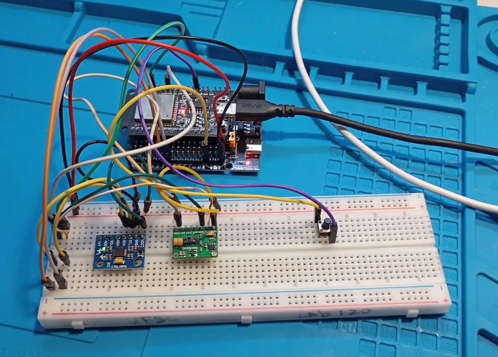
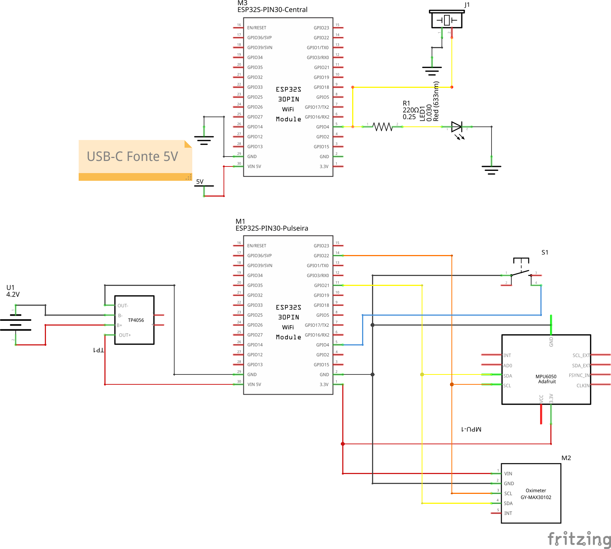
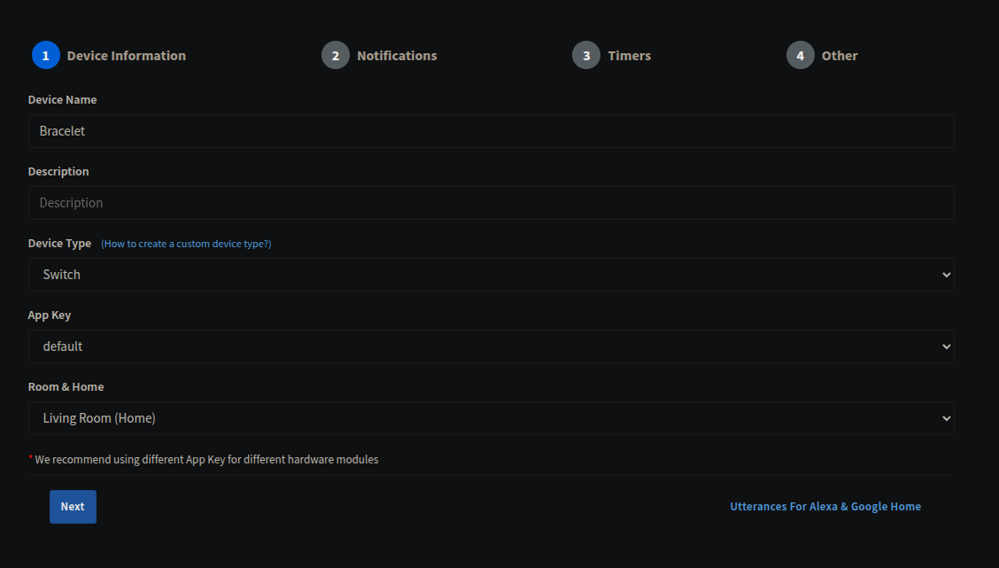

# Bracelet for monitoring safety of seniors with Sinric Pro

<!--  -->


---

## Project Overview
This is a prototype for a security bracelet for the elderly and vulnerable that monitors 
heartrate, oxigen levels, falls and emmits an emergency alert to Sinric Pro when needed.



The Hardware consists of an ESP32 microcontroller paired togheter with a MPU6050 for measuring acceleration, a MAX10102 for measuring heartrate and O2 levels and an emergency button.



The Firmware is written in C++ and uses the PlatformIO framework with arduino and freertos libs, reading data from the sensors with I2C. 

It reads data at 1hz frequency from the mpu6050 for better collision, it also filters the data by comparing the current acceleration value with an average of the values during the last 2 seconds, this allows us to notice when a value is an outlier, but also helps ignoring some false positives.
It also waits an interval of 10 seconds between alerts to avoid spamming the Sinric Pro API.

---

## Setup

Install PlatformIO following their [documentation](https://platformio.org/install). 

Create an account on [Sinric Pro](https://sinric.pro/) and create a new device, select switch as the type and ensure the notification setting is enabled. After that you can go to your device page and get it's credentials.



Clone this repo 

Go to bracelet/src/credentials.h and substitute your Sinric Pro credentials accordingly there.

Build / Flash by running the following command inside bracelet/

``pio run -t upload``

To Build / Flash with debugging enabled run,

``pio run -e debug -t upload``

On debug mode the esp will have slightly smaller collision detection thresholds for better testing.
You can also edit bracelet/platformio.ini to change the compile flags, the available options are also documented on the file itself.
The available flags that can be set are:

- DEBUG
- DISABLE_OXM
- LANG_BR

You may also change the acceleration thresholds used for collision detection in 
bracelet/src/main.cpp

```
#define ACCEL_DANGER_THRESHOLD 14
#define ACCEL_DIFF_THRESHOLD 1
```
by default the debug value is more sensible for easier testing

---

## Project structure
```
.
├── 📁bracelet
│   ├── 📄compile_commands.json
│   ├── 📄diagram.json
│   ├── 📄platformio.ini
│   ├── 📁src
│   │   ├── 📄credentials.h
│   │   ├── 📄main.cpp
│   │   └── 📄types.h
│   └── 📄wokwi.toml
├── 📁img
│   ├── 🖼️circuit.png
│   └── 🖼️sinric.png
├── 📁PCBlayout
│   └── 📄README.md
└── 📄README.md

```

---

## Authors

- Vivianne Coelho Fernandes
- Grégori Silva Grazziani de Oliveira
- Vinicius Caio Rodrigues
